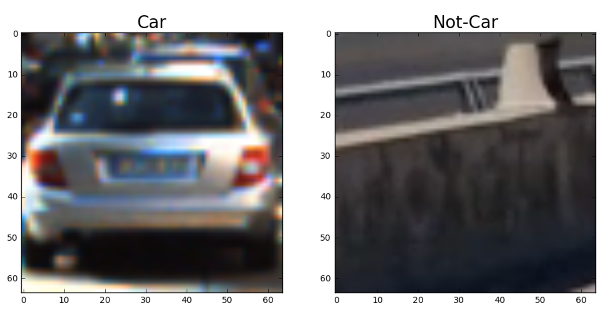
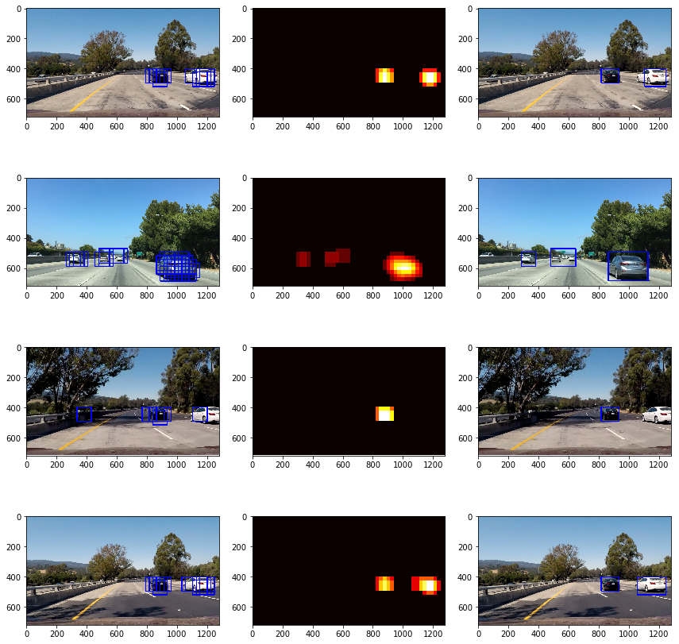

## Vehicle Detection Project

The goals / steps of this project are the following:

* Perform a Histogram of Oriented Gradients (HOG) feature extraction on a labeled training set of images and train a classifier Linear SVM classifier
* Optionally, you can also apply a color transform and append binned color features, as well as histograms of color, to your HOG feature vector. 
* Note: for those first two steps don't forget to normalize your features and randomize a selection for training and testing.
* Implement a sliding-window technique and use your trained classifier to search for vehicles in images.
* Run your pipeline on a video stream (start with the test_video.mp4 and later implement on full project_video.mp4) and create a heat map of recurring detections frame by frame to reject outliers and follow detected vehicles.
* Estimate a bounding box for vehicles detected.

[//]: # (Image References)
[image1]: ./examples/car_not_car.png
[image2]: ./examples/HOG_example.jpg
[image3]: ./examples/sliding_windows.jpg
[image4]: ./examples/sliding_window.jpg
[image5]: ./examples/bboxes_and_heat.png
[image6]: ./examples/labels_map.png
[image7]: ./examples/output_bboxes.png
[video1]: ./project_video.mp4

### Histogram of Oriented Gradients (HOG)

#### 1. Explain how (and identify where in your code) you extracted HOG features from the training images.

The code for this step is contained in `def_hog_features()` in `pipeline.py`). I did not modify the code from the lessons.  

I started by reading in all the `vehicle` and `non-vehicle` images.  Here is an example of one of each of the `vehicle` and `non-vehicle` classes:




#### 2. Explain how you settled on your final choice of HOG parameters.

After exploring different parameters, I settled with the parameters below and kept in a dict as kwargs:
```python
color_space: 'YCrCb'
spatial_size: (32, 32)
hist_bins: 32
cell_per_block: 2
hog_channel: 'ALL'
pix_per_cell: 8
orient: 9
spatial_feat: True
hist_feat: True
hog_feat: True
```
The default parameters worked well enough, with the exception of YCrCb color space, which was recommended in the forum.

#### 3. Describe how (and identify where in your code) you trained a classifier using your selected HOG features (and color features if you used them).

I trained a linear SVM using `LinearSVC` from `scikit-learn` package with spatial, hist, and hof features.


### Sliding Window Search and Heatmap

Window search was done at the bottom half of the image using `scale=1.5` The images below show the pipeline to detect multiple detection and false positives. First I show that different boxes scan the image and identify vehicles. Then I use `label` function from `scikit-learn` and set `threshold=1` to avoid false positive. Notice the left box (false positive) from the first image in the 3rd row. Thresholding successfully removes that image. However, in the same image, we discard the correctly-identified white vehicle on the right.


---

### Video Implementation

Here's a [link to my video result](https://youtu.be/PR4WwWF4D88)


---

### Discussion

-- I could implement a class for the box to take last few frames for smoothing.

-- Cars are not detected when it first appears, because of scaling/window size. If I use smaller window size, then perhaps it can detect the car in its early entry.

-- There is a flash of one second where shadow distorts the detection. These frames caused problems in the previous project as well. Make my color space more robust to that.
